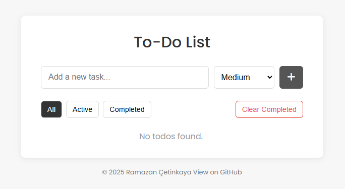

# To-Do List

[](LICENSE)
[](https://github.com/ramazancetinkaya/simple-todolist/issues)
[](https://github.com/ramazancetinkaya/simple-todolist/stargazers)
[](https://github.com/ramazancetinkaya/simple-todolist/network)

A **minimalist**, **responsive**, and **feature-rich** To-Do List web application built with **HTML**, **CSS**, and **Vanilla JavaScript**.

### 🌟 Star this Repository!

Hi there! We're thrilled that you stopped by to check out our project. This repository is a labor of love, built with passion, creativity, and plenty of late-night coding sessions. We truly believe in what we're creating, and we hope you'll enjoy using it as much as we enjoyed building it.

If our project adds value to your day or if you’re simply a fan of cool, open-source software, please consider giving it a star ⭐. Your support inspires us to keep pushing forward!

---

## Table of Contents

- [Features](#features)
- [Demo](#demo)
- [Screenshot](#screenshot)
- [Installation](#installation)
- [Usage](#usage)
- [Contributing](#contributing)
- [License](#license)
- [Contact](#contact)

## Features

- **Responsive Design:** Works flawlessly on mobile, tablet, and desktop devices.
- **Input Validation:** Ensures todos are entered using only allowed characters, with defined minimum and maximum character limits.
- **Dynamic Priority Management:** Todos are automatically sorted by priority (High, Medium, Low) and users can cycle through priority levels by clicking on the indicator.
- **Undo Functionality:** Restore accidentally deleted todos within a 5-second window.
- **Toast Notifications:** Smooth, responsive notifications that provide instant feedback without overflow issues.
- **CRUD Operations:** Add, edit, and delete todos with modal support.
- **Local Storage Persistence:** Todos are saved locally so they remain between sessions.
- **Modern Minimalist UI:** Clean design with professional styling.

## Demo

Experience the application instantly via GitHub Pages:

[](https://ramazancetinkaya.github.io/simple-todolist/)

## Screenshot

<p align="center">
  <a href="https://github.com/ramazancetinkaya/simple-todolist">
    
  </a>
</p>

## Installation

There are two methods to get this project up and running on your local machine.

### Prerequisites

- A modern web browser (Chrome, Edge, Firefox, Safari, etc.)
- Download [Git](https://git-scm.com/) *(optional, if you choose to clone the repository)*

### 1. Clone the Repository

If you have Git installed, you can clone the repository by following these steps:

1. Open your **terminal** or **command prompt**.

2. Run the following command:
   
    ```bash
    git clone https://github.com/ramazancetinkaya/simple-todolist.git
    ```

4. Navigate into the project directory:

    ```bash
    cd simple-todolist
    ```

### 2. Download as ZIP

If you prefer not to use Git, you can download the project as a ZIP file:

1. Go to the GitHub repository page in your web browser.
2. Click the green **"Code"** button at the top right of the repository's file list.
3. Select **"Download ZIP"** from the dropdown menu.
4. Once the ZIP file is downloaded, extract it to your desired location.

## Usage

Follow these steps to get started:

1. **Open the Project:**  
   Navigate to the project folder and open `index.html` in your preferred web browser.

2. **Add a Todo:**  
   - Enter a todo in the input field (must meet validation criteria).  
   - Select a priority from the dropdown (Low, Medium, High).  
   - Click **Add** or press **Enter**.

3. **Edit or Delete Todos:**  
   - Click the edit icon to modify a todo.  
   - Click the trash icon to delete a todo; a toast notification with an **Undo** option will appear.

4. **Change Priority:**  
   - Click the circular priority indicator next to a todo to cycle through its priorities.  
   - The list automatically re-sorts based on priority.

5. **Filter Todos:**  
   - Use the filter buttons (All, Active, Completed) to view specific todos.  
   - Use the **Clear Completed** button to remove all completed todos.

## Contributing

Contributions are welcome! Please feel free to submit a pull request or open an issue for any enhancements or bug fixes.

## License

This project is licensed under the MIT License. See the [LICENSE](LICENSE) file for more details.

## Contact

For any inquiries, please contact:

- **Ramazan Çetinkaya** – [ramazancetinkayasoftware@proton.me](mailto:ramazancetinkayasoftware@proton.me)
- GitHub: [@ramazancetinkaya](https://github.com/ramazancetinkaya)
